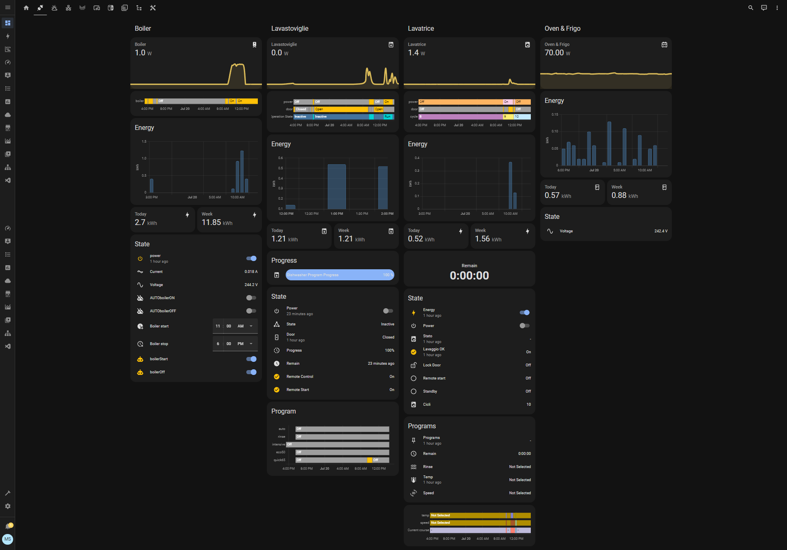
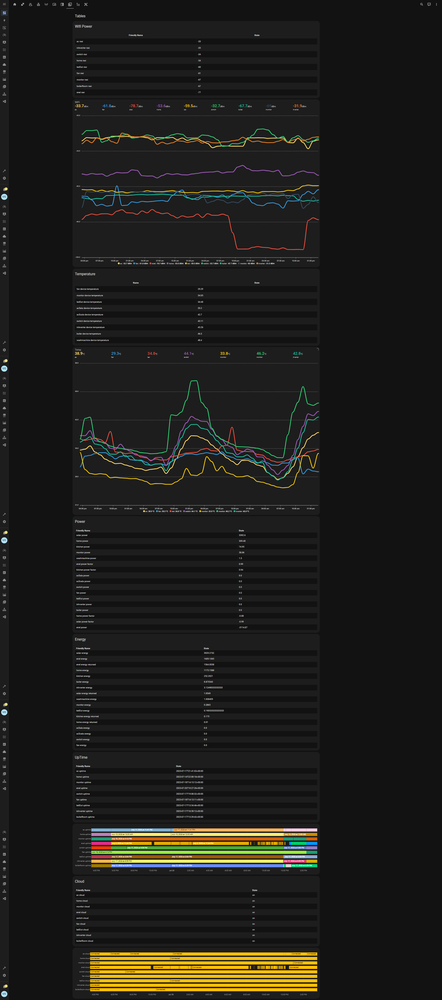

# homeAutomation project
    author: kito129
    date: 2021/03/01
    last update: 2021/20
    version: v2023.7.1.0
    docVersion: 1.0

## Description

This project is a home automation project. It is based on a Home Assistant OS, running on i7 workstation.
My current setup is:

    - 1x i7-12900k workstation 
    - Hyper-V virtualizer on Windows 10 running Home Assistant OS and Core 
    
Versioning is based on the Home Assistant versioning. The last number is the version of the project.

### Code Base
    Home Assistant 2023.6.3
    Supervisor 2023.07.1
    Operating System 10.3
    Frontend 20230608.0 - latest

## Network

All network devices are connected to TpLink Deco M5 mesh network. The mesh network is connected to the ISP fiber router.
Based on 5 Decos, the mesh network covers the whole house and garden.

The LAN network is based on a 3, 5 port TPlink switch that wires 4 Decos, only one is WiFi only connected.
DHCP, Firewall, DNS, NTP, VPN, etc. are all managed by the Main Deco in WiFi Mode, WLAN is provided by OpenFiber ZTE H3600 v9 Router. 

## Integrations

## Addons

## Devices

### Workstation

| Type              | Value                                                            |
|-------------------|------------------------------------------------------------------|
| Case              | PCS P209 ARGB MID TOWER CASE                                     |
| Processor         | Intel® CoreTM i9 16-Core Processor i9-12900K (3.2GHz) 30MB Cache |
| Motherboard       |  ASUS® PRIME H610M-A D4: Micro-ATX, DDR4, USB 3.2, SATA 6GBs     |
| Memory            | 32GB Corsair VENGEANCE DDR4 3200MHz (2 x 16GB)                   |
| Graphics Card     | 6GB NVIDIA GEFORCE GTX 1660                                      |
| 1st Storage       | 960GB Kingston SSD  2,5" SATA                                    |
| 2st Storage       | 4TB Western Digital Red Plus 3.5" SATA3 NAS Hard Drive           |
| Power Supply      | CORSAIR 450W CV SERIESTM CV-450 POWER SUPPLY                     |
| Processor Cooling | Corsair H100x Hydro Series High Performance CPU Cooler           |
| Thermal Paste     | ARCTIC MX-4 EXTREME THERMAL CONDUCTIVITY COMPOUND                |
| Sound Card        | ONBOARD 6 CHANNEL (5.1) HIGH DEF AUDIO (AS STANDARD)             |
| Network Card      | 10/100/1000 GIGABIT LAN PORT                                     |
| Wireless Network  | INTEL® Wi-Fi 6 AX200 2,400Mbps/5GHz, 300Mbps/2.4GHz              |
| PCI-ECARD         | CARD + BT 5.0                                                    |
| USB/Thunderbolt   | 2 x USB 3.0 & 2 x USB 2.0 PORTS @ BACK PANEL + MIN. 2 FRONT      |
| OS                | Windows 10 Professional 64 Bit                                   |

### Network

| ID  | Qt. | Name  | Type  | 
|---|---|---|---|
| 1 | 5 | Tp-Link  |  Deco M5 | 
| 2 | 2 |  TPlink |  LS105G  | 
| 3 | 1 |  Shelly |  LS108G | 
| 4 | 1 |  ZTE |  H3600 v9 | 
| 5 | 1 |  OpenFiber |  FTTH-ETH | 

all wired via CAT7 cables

### Shelly

| ID  | Qt. | Name  | Type  | 
|---|---|---|---|
| 1 | 4 | Shelly  |  PM 1 | 
| 2 | 2 |  Shelly |  EM | 
| 3 | 2 |  Shelly |  PRO2 PM |
| 4 | 2 |  Shelly |  PLUG S |

### ESP

| ID  | Name  | Type  | Device  |
|---|---|---|---|
| 1 | ESP-WROOM-32  |  ESP-32 |  TempOut |
| 2 |  CUQI |  GY-BME280  | TO INSTALL  |

### Amazon Alexa

| ID  | Name  | Type  | Device  |
|---|---|---|---|
| 1 | Alexa  |  Dot |  5gen |
| 2 |  Alexa |  Pop  | 1gen  |

### Appliances

| ID  | Name  | Type  | Device  |
|---|---|---|---|
| 1 | Bosch  |  Dishwasher |  SMV4EVX14E |
| 2 |  LG |  Washing Machine | F4WV510S0E  |
| 3 | Hisense  | Tv  | 43" UHD 4K 2022 43A6FG  |

## Dashboard
Home

Appliances

Network

Weather

Automation

Charts

Shelly Charts

