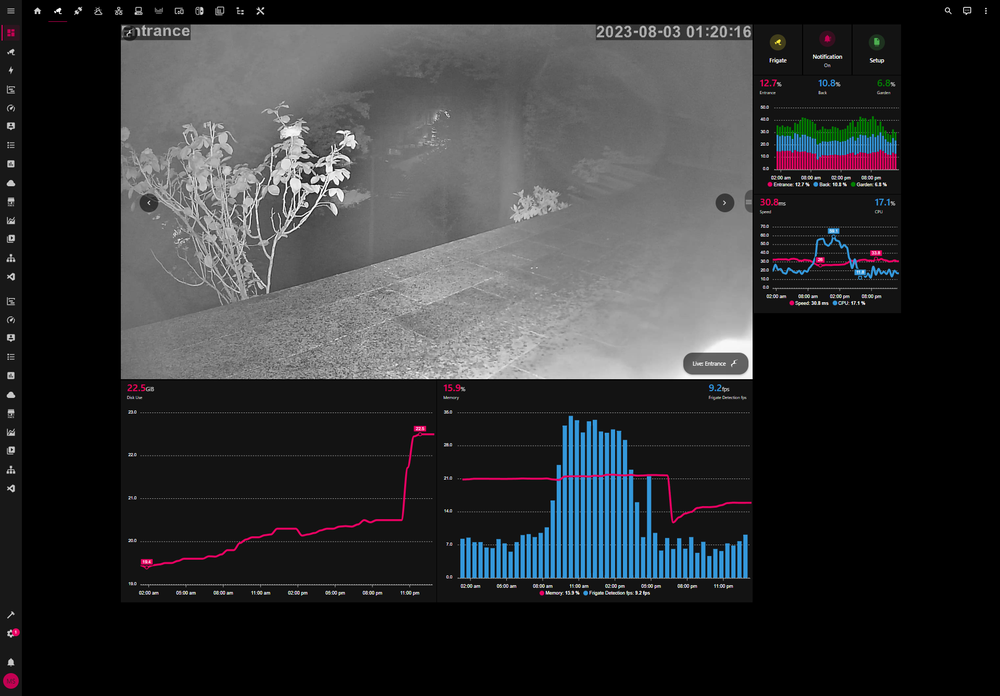
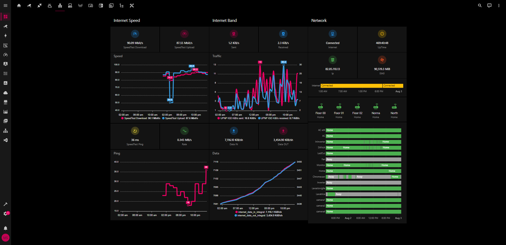
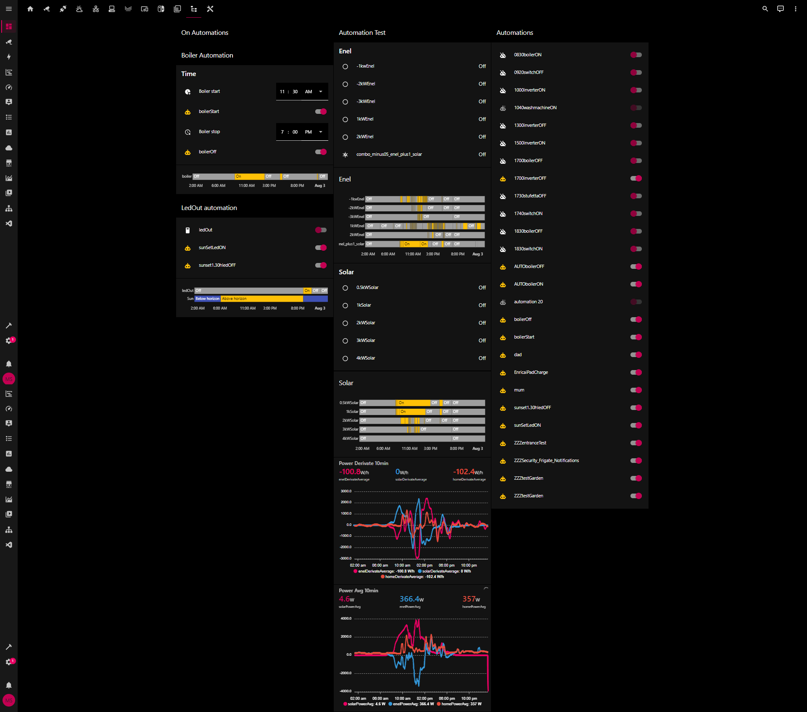
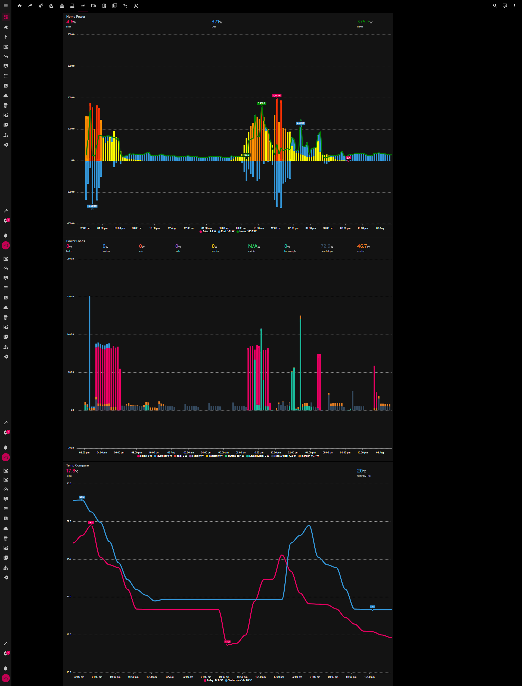
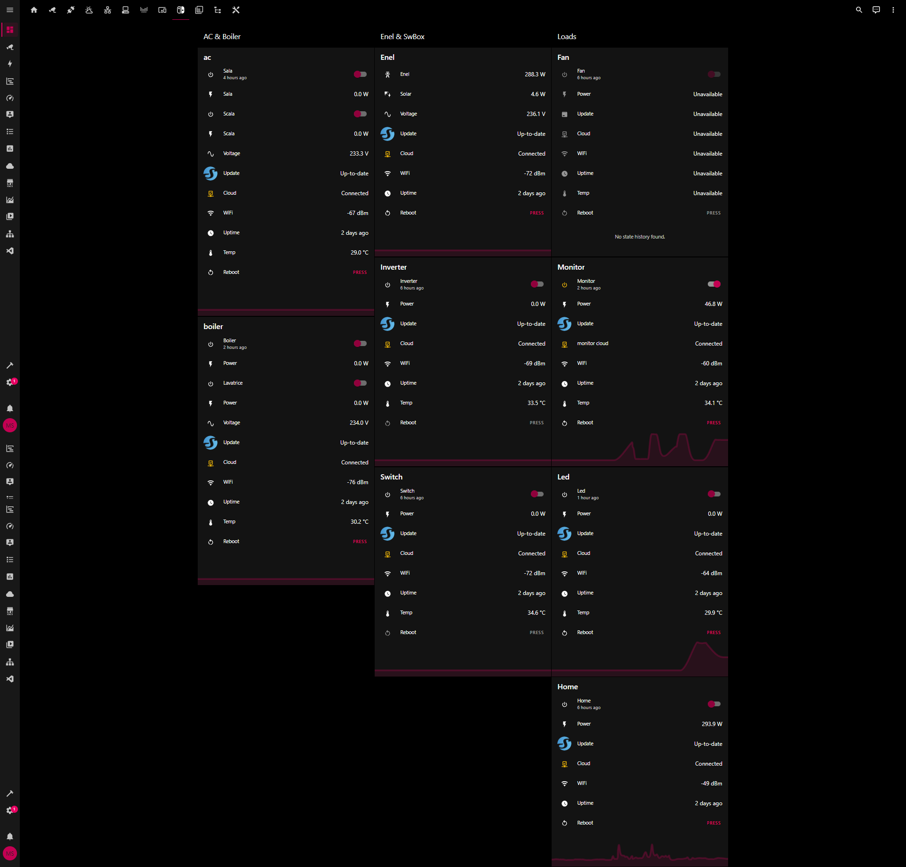
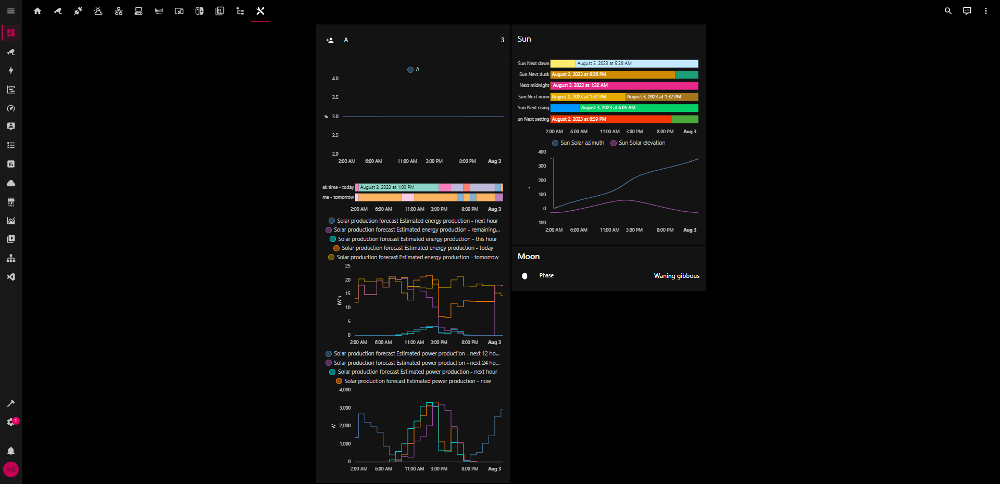

# homeAutomation project
    author: kito129
    date: 2023/03/01
    last update: 2023/10/28
    version: v2023.10.0.2
    docVersion: 1.0

## Change Log:

[Changelogs page](https://github.com/kito129/homeAssistantKito/blob/main/changelogs.md)

## Description

This project is a home automation project. It is based on a Home Assistant OS, running on i7 workstation.
My current setup is:

    - 1x i7-12900k workstation 
    - Hyper-V virtualizer on Windows 10 running Home Assistant OS and Core 
    
Versioning is based on the Home Assistant versioning.

### Code Base
    Home Assistant 2023.10.3
    Supervisor 2023.10.0
    Operating System 10.5
    Frontend 20231005.0 - latest

## Network

All network devices are connected to TpLink Deco M5 mesh network. The mesh network is connected to the ISP fiber router.
Based on 5 Decos, network covers the whole house and 3 gardens.

The LAN network is based on  x3 TPlink switch 5 port that wires 4 Decos, only one is WiFi only connected.
DHCP, Firewall, DNS, NTP, VPN, etc. are all managed by the Main Deco in WiFi Mode, WLAN is provided by OpenFiber ZTE H3600 v9 Router. 

## Integrations

- AccuWeather
- Alexa Media Player
- DLNA DMR
    - KitchenTV
- Electricity Maps  // CO2 services
- Forecast.Solar
- Frigate
- Google Cast
- HACS
- Home Connect      // Bosch dishwasher
- Home Assitant iOS
- Home Assistant Supervisor
- HomeKit Device
- Mobile App
- Moon
- MQTT
- Node-RED
- Pi-Hole
- Scheduler
- Shelly
- SmartThings LG    // LG washing machine
- Speedtest.net
- Spotify
- Sun
- TP-Link Deco
- UPnP

## Addons

- ESPHome
- Frigate Full Access
- Glances
- Grafana
- InfluxDB
- MariaDB
- Mosquitto broker
- Node-RED
- Samba share
- Terminal & SSH
- Visual Studio Code

## Devices

### Workstation

| Type              | Value                                                            |
|-------------------|------------------------------------------------------------------|
| Case              | PCS P209 ARGB MID TOWER CASE                                     |
| Processor         | Intel® CoreTM i9 16-Core Processor i9-12900K (3.2GHz) 30MB Cache |
| Motherboard       |  ASUS® PRIME H610M-A D4: Micro-ATX, DDR4, USB 3.2, SATA 6GBs     |
| Memory            | 32GB Corsair VENGEANCE DDR4 3200MHz (2 x 16GB)                   |
| Graphics Card     | 6GB NVIDIA GEFORCE GTX 1660                                      |
| 1st Storage       | 960GB Kingston SSD  2,5" SATA                                    |
| 2st Storage       | 4TB Western Digital Red Plus 3.5" SATA3 NAS Hard Drive           |
| Power Supply      | CORSAIR 450W CV SERIESTM CV-450 POWER SUPPLY                     |
| Processor Cooling | Corsair H100x Hydro Series High Performance CPU Cooler           |
| Thermal Paste     | ARCTIC MX-4 EXTREME THERMAL CONDUCTIVITY COMPOUND                |
| Sound Card        | ONBOARD 6 CHANNEL (5.1) HIGH DEF AUDIO (AS STANDARD)             |
| Network Card      | 10/100/1000 GIGABIT LAN PORT                                     |
| Wireless Network  | INTEL® Wi-Fi 6 AX200 2,400Mbps/5GHz, 300Mbps/2.4GHz              |
| PCI-ECARD         | CARD + BT 5.0                                                    |
| USB/Thunderbolt   | 2 x USB 3.0 & 2 x USB 2.0 PORTS @ BACK PANEL + MIN. 2 FRONT      |
| OS                | Windows 10 Professional 64 Bit                                   |

### Network

| ID  | Qt. | Name  | Type  | 
|---|---|---|---|
| 1 | 5 |  TPLink |  Deco M5 | 
| 2 | 2 |  TPlink |  LS105G  | 
| 3 | 1 |  Shelly |  LS108G | 
| 4 | 1 |  ZTE |  H3600 v9 | 
| 5 | 1 |  OpenFiber |  FTTH-ETH | 

All wired via CAT7 cables

### Shelly

| ID  | Qt. | Name  | Type  | 
|---|---|---|---|
| 1 | 4 |  Shelly |  PM 1 | 
| 2 | 2 |  Shelly |  EM | 
| 3 | 2 |  Shelly |  PRO2 PM |
| 4 | 2 |  Shelly |  PLUG S |
| 5 | 6 |  Shelly |  PM 2 |
| 6 | 1 |  Shelly |  H&T v2 |

### ESP

| ID  | Name  | Type  | Device  |
|---|---|---|---|
| 1 | ESP-WROOM-32  |  ESP-32 |  TempOut |
| 2 |  CUQI |  GY-BME280  | TO INSTALL  |

### Amazon Alexa

| ID  | Name  | Type  | Device  |
|---|---|---|---|
| 1 | Alexa  |  Dot |  5gen |
| 2 |  Alexa |  Pop  | 1gen  |

### Appliances

| ID  | Name  | Type  | Device  |
|---|---|---|---|
| 1 | Bosch  |  Dishwasher |  SMV4EVX14E |
| 2 |  LG |  Washing Machine | F4WV510S0E  |
| 3 | Hisense  | Tv  | 43" UHD 4K 2022 43A6FG  |
| 4 |  Ariston Lydos  | HeatPump Boiler  |  Hybrid 80 litri -- TO INSTALL WIFI  |

# Dashboard

Dashboard lovelace screenshots

### Home

### CCTV

### Appliances

### Network

### Weather

### Automation

### Charts

### Shelly

### Shelly Charts

### Tools

